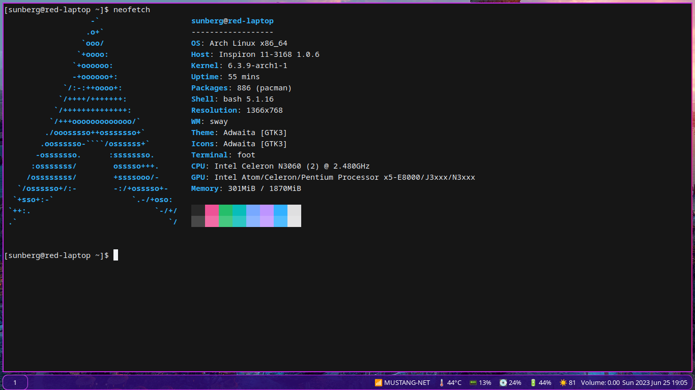
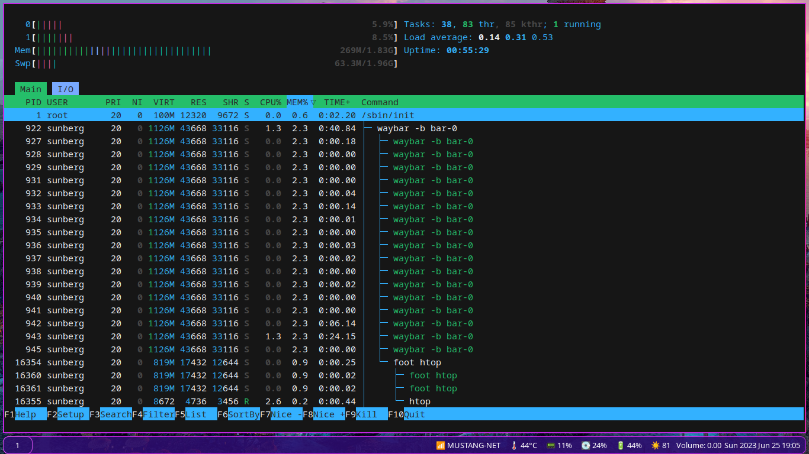
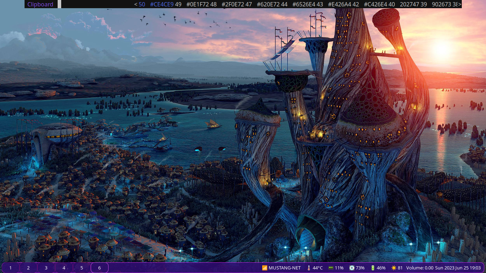

# Sway-Wayland-Configs
A Collection of Configuration Files for my Desktop Environment.  
Basically everything wayland/wireplumber, with heavy performance considerations.  
My system uses under 300M RAM with nothing open.  
Includes configurations for:  
- Foot  
- Networkmanager_dmenu  
- Pipewire  
- Pulse  
- Sway  
- Swaynag  
- Waybar  
- Wofi
- Vim

Additional Packages:  
- Noto-Fonts -- Font  
- Noto-Fonts-Emoji -- Emoji  
- Bemenu -- Clipboards and Networking  
- Mako -- Notifications  
- Light -- Brightness Control  
- Imv -- CLI Image Viewer  
- Grim/Grimshot -- Screenshots  
- Swayidle -- Sway Lockscreen  
- Swaylock-effects -- Lock Screen Effects  
- I3Keys -- Show Keybindings in a GUI  
- Swaybg  
- Wayland  
- See more installed packages in the packages file.

